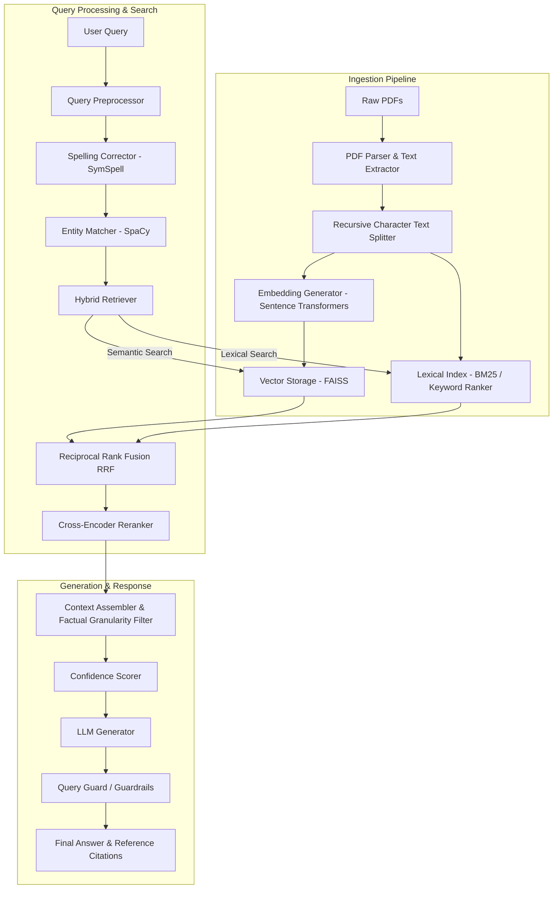

# Hybrid RAG Chatbot

An enterprise-grade, high-performance hybrid retrieval-augmented generation (RAG) chatbot system featuring dense semantic vector search (FAISS + Sentence Transformers), sparse lexical search (BM25), cross-encoder reranking, robust query guardrails, and an immersive 3D WebGL user interface.

[](https://www.python.org/)
[](https://fastapi.tiangolo.com/)
[](https://react.dev/)
[](https://www.typescriptlang.org/)
[](LICENSE)
[](https://github.com/ayushiii2707/hybrid-rag-chatbot/actions/workflows/python.yml)

---

## Key Highlights

* ⚡ **Multi-Stage Retrieval Engine**: Fuses dense semantic search results (`FAISS` + `sentence-transformers`) with sparse lexical queries (`BM25`) using Reciprocal Rank Fusion (RRF) and filters candidates through a Cross-Encoder Reranker.
* 🛡️ **Advanced NLP Preprocessing**: Employs real-time spelling correction (`symspellpy`) and named entity extraction (`spacy`) to clean incoming query strings before search execution.
* 📊 **Confidence Evaluation & Guardrails**: Evaluates context-query alignment on-the-fly to assign confidence scores and runs proactive security filters (`QueryGuard`) to stop prompt injections.
* 🎨 **Immersive 3D Visualization**: Built with Vite, React Three Fiber, React Three Drei, and GSAP to render interactive 3D WebGL scenes, particle networks, and rich data tables.
* 📈 **Offline Benchmarking**: Standardized test harnesses and benchmark files (`benchmark_queries.csv`) to test accuracy, completeness, and response times.

---

## Table of Contents
1. [Features](#features)
2. [Tech Stack](#tech-stack)
3. [Architecture Overview](#architecture-overview)
4. [Folder Structure](#folder-structure)
5. [Installation & Configuration](#installation--configuration)
6. [Running the Project](#running-the-project)
7. [API Endpoints](#api-endpoints)
8. [Future Improvements](#future-improvements)
9. [License](#license)

---

## Features

* **Hybrid Retrieval**: Combines semantic retrieval (dense vectors via FAISS and `sentence-transformers`) with lexical search (sparse keyword match via BM25).
* **Reciprocal Rank Fusion (RRF)**: Merges sparse and dense search results using rank-based reciprocal scores.
* **Cross-Encoder Reranking**: Re-orders fused candidates to ensure the most relevant contexts are prioritized in the LLM window.
* **Advanced Preprocessing**: Performs tokenization, spelling correction (`symspellpy`), and entity matching (`spacy`) on the input query.
* **Factual Context Assembly**: Synthesizes clean context blocks with reference citations, checking for query-context relevance.
* **Confidence Scoring & Guardrails**: Scores the confidence of the retrieved context and runs guardrails (`QueryGuard`) to prevent prompt injection and hallucinations.
* **Interactive 3D Web Interface**: Immersive frontend featuring custom WebGL, Three.js scenes, interactive charts, and dashboard views.

---

## Tech Stack

### Backend
* **Core Framework**: FastAPI, Uvicorn, Pydantic (v2)
* **Database & ORM**: PostgreSQL, SQLAlchemy, Psycopg2-binary
* **Retrieval & NLP**: SpaCy, SymSpellPy, FAISS-cpu, Sentence-Transformers, NumPy, PyMuPDF (PyMuPDF / Fitz)
* **Security**: python-dotenv, python-jose, bcrypt

### Frontend
* **Framework**: React, Vite, TypeScript
* **UI Components**: Radix UI, Tailwind CSS, Framer Motion, Lucide Icons, Recharts
* **WebGL / 3D Graphics**: Three.js, React Three Fiber, React Three Drei, GSAP

---

## Architecture Overview

The system uses a multi-stage ingestion, preprocessing, retrieval, and generation pipeline:



---

## Folder Structure

```
.
├── .github/                 # GitHub Actions workflows configuration
├── .gitignore               # Multi-environment file ignore configuration
├── LICENSE                  # Standard MIT License
├── README.md                # Project documentation
├── requirements.txt         # Consolidated python dependencies
├── run_audit.py             # Diagnostic audit script for RAG retrieval evaluation
├── run_test_query.py        # Utility script to test custom queries against the engine
├── backend/
│   ├── .env.example         # System configuration template
│   ├── auth/                # JWT Auth, OTP, Password services, & rate limiting
│   ├── chunking/            # PDF chunking and splitting strategies
│   ├── database/            # Database engine and session setup
│   ├── datasets/            # Resource manuals and raw PDF data
│   ├── embeddings/          # Vector storage (FAISS) and embedding generator
│   ├── evaluation/          # RAG benchmarks and offline evaluator
│   ├── ingestion/           # PDF ingestion and parser pipeline
│   ├── logging/             # Session metrics and query logger
│   ├── main.py              # Application entrypoint (FastAPI)
│   ├── preprocessing/       # Spelling correction, entity matcher, and text cleaners
│   ├── query_engine/        # Context assembler, confidence scorer, and orchestrator
│   ├── requirements.txt     # Dedicated backend dependencies
│   ├── retrieval_intelligence/ # Hybrid retrieval, keyword ranking, and reranking
│   ├── security/            # Query injection guardrails
│   ├── services/            # Cleanup and email services
│   └── tests/               # Unit and integration test suites
└── frontend/
    ├── artifacts/           # Vite Web App React application
    ├── lib/                 # Shared React client API wrappers
    ├── package.json         # Workspace package config (PNPM)
    └── pnpm-workspace.yaml  # Workspace directory definition
```

> [!NOTE]  
> The diagnostic and utility scripts (`run_audit.py` and `run_test_query.py`) are kept at the root of the repository. This guarantees that developers can run them directly out-of-the-box without modifying their internal `sys.path` resolution logic or changing run configurations.

---

## Installation & Configuration

### Prerequisites
* Python 3.10+
* PNPM (for frontend)
* PostgreSQL (optional, fallback configurations exist)

### Environment Variables
Copy the template configuration in the `backend/` directory to create a `.env` file:
```bash
cp backend/.env.example backend/.env
```
Fill out the variables including `DATABASE_URL` and `JWT_SECRET_KEY`.

---

## Running the Project

### 1. Backend Setup & Run
Install the dependencies from the root directory:
```bash
pip install -r requirements.txt
```

Download the required SpaCy model:
```bash
python -m spacy download en_core_web_sm
```

Start the FastAPI backend:
```bash
cd backend
uvicorn main:app --reload --port 8000
```
The documentation will be available at `http://localhost:8000/docs`.

### 2. Frontend Setup & Run
Make sure you are at the repository root, then navigate to the frontend:
```bash
cd frontend
pnpm install
pnpm --filter "@workspace/particle-site" run dev
```

---

## API Endpoints
The backend exposes RESTful endpoints:
* `POST /auth/register` - Registers a new user.
* `POST /auth/login` - Authenticates and returns a JWT token.
* `POST /chat/query` - Submits a query to the hybrid RAG pipeline.
* `GET /metrics` - Performance indicators and query confidence diagnostics.

---

## Future Improvements
* **Dynamic Chunking**: Adapt text splitting windows based on visual structure of PDFs.
* **Reranker Optimization**: Transition from CPU-based Cross-Encoders to specialized inference APIs for lower latency.
* **Database Scaling**: Implement PgVector to support vector operations natively in PostgreSQL.

---

## License
Distributed under the MIT License. See `LICENSE` for more information.
